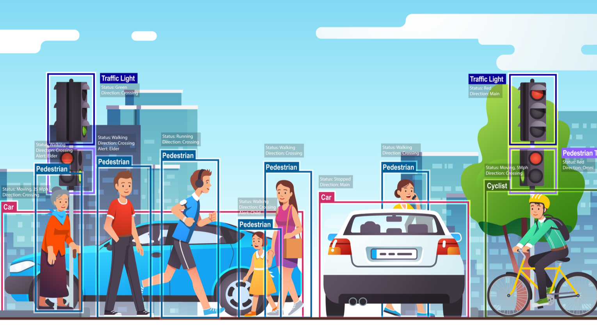
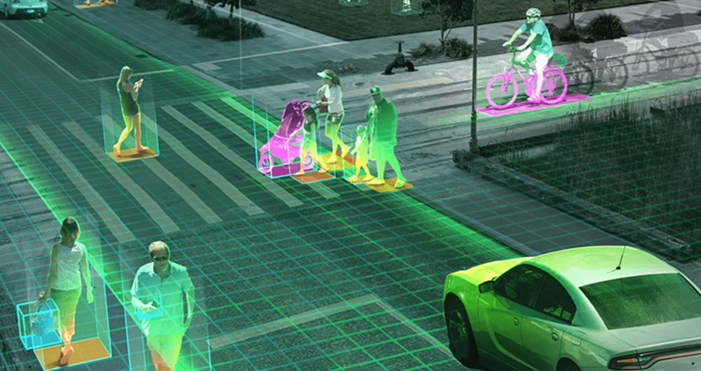
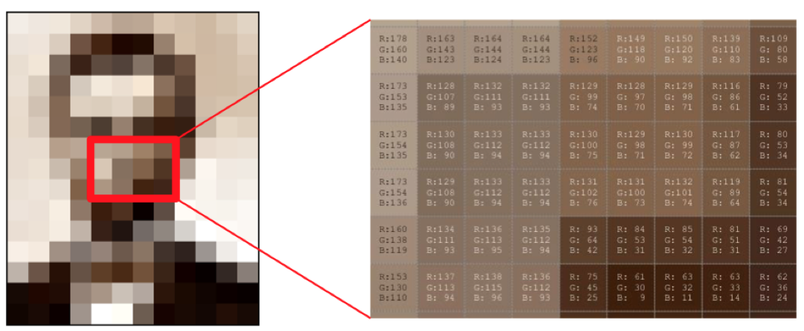
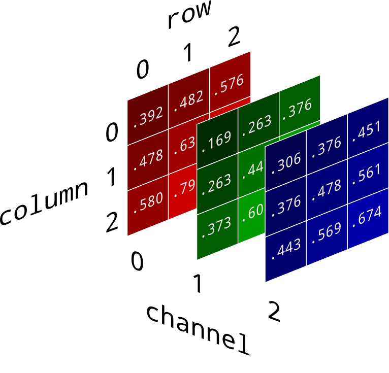

In this article, we are excited to be at the forefront of this exciting and
rapidly developing technology and to share a few of our projects for
demonstration.

<!-- truncate -->

---

## Computer vision

​​​​​​​Related work To read about our projects using computer vision, click on
the links below:

Seed classification: Automatic Quality Control using Computer Vision

Artificial Intelligence (AI) for image processing tasks has revolutionised our
ability to recover valuable insights from visual information. The advances
computer vision research and their integration in industries have created an
unprecedented opportunity for enhanced efficiency and accuracy in areas such as:
quality control, object detection and classification, surveillance, and more.

### Our mission

Here, at the CFIA's AI Lab, we harness the full potential of computer vision
models to develop innovative solutions to meet our clients specific needs.  We
describe some of our projects where we employ custom computer vision models for
image classification tasks and encourage you to visit these pages by clicking on
their respective links.

To understand how image classification models work, we first provide an overview
of the fundamental concepts in computer vision, including important
considerations that must be made when working with image data.

As CFIA Data Scientists, we are committed to knowledge sharing, transparency,
and accessibility. Through this post, we aim to define the underlying workings
of computer vision models to provide clarity and understanding of this
technology and how we leverage these powerful models, for those interested in
the field.

---

## Introduction to computer vision

To skip the introduction and jump directly to:

[Deep Learning computer vision models](#introduction-to-computer-vision)

### _What is computer vision?_

Computer vision models aim to solve what is mathematically referred to as
ill-posed problems. They seek to answer the question: what gave rise to the
image?​​​​​​​​​​​​​​

As humans, we do this naturally. When photons enter our eyes, our brain is able
to process the different patterns of light enabling us to infer the physical
world in front of us.

In the context of computer vision, we are trying to replicate our innate human
ability of visual perception through mathematical algorithms.

---

Computer vision models could then be used to address questions related to:

#### Object Detection and Categorisation

The ability to classify objects in an image scene or recognise someone’s face in pictures.

#### Scene and Context Categorisation

The ability to understand what is going in an image through its components (e.g. indoor/outdoor, traffic/no traffic, parking/no-parking, etc.)

#### Qualitative Spatial Information

The ability to qualitatively describe objects in an image, such as a rigid moving object (eg. bike, stroller), a non-rigid moving object (eg. flag), a vertical/horizontal/slanted object, etc.

---

Yet, while these appear to be simple tasks, computers still have difficulties in accurately interpreting and understanding our complex world.

---

#### Why is computer vision so hard?

In order to understand why computers seemingly struggle to perform these "basic" tasks, we must first consider what an image is.

### What computers "see"

Are you able to describe what this image is from these values?

**_An image is a set of number, with typically three colour channels: Red, Green, Blue._**

To derive meaning from these values, the computer must perform what is known as image reconstruction. In its most simplified form, we can consider this process as an inverse problem​​​​​​​, defined by:

x = F-1(y)

where:

y represents data measurements (ie. pixel values).
The solution, x, is an image.
F-1(·) is the inverse function which transforms pixel measurements, y, into the reconstructed image, x.

