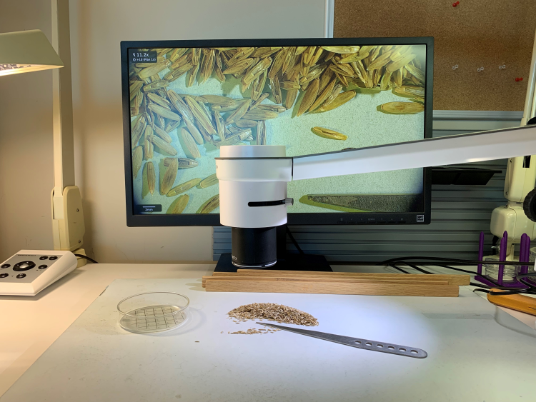

# Overview

## What is Nachet?

The CFIA ensures that seeds or grains crossing Canadian borders meet strict
phytosanitary standards to prevent the spread of invasive weed species. Nachet
Interactive is an open-source web application developed to assist CFIA seed
analysts in identifying regulated weed seeds quickly and accurately. It combines
digital microscopy with computer vision models hosted on AzureML to streamline
the seed inspection process.

Initially focused on weed seed identification, Nachet Interactive's scope is
expanding to include other tasks like identifying pure seeds and insects,
showcasing the application's versatility. This tool aims to support CFIA
scientists by integrating AI into their workflow.

### Seed Species

Currently we are training our models to identify these 15 species:

| **Species** |
|:--:|
| Ambrosia artemisiifolia  |
| Ambrosia trifida |
| Ambrosia psilostachya |
| Brassica junsea |
| Brassica napus |
| Bromus hordeaceus |
| Bromus japonicus |
| Bromus secalinus |
| Carduus nutans |
| Cirsium arvense |
| Cirsium vulgare |
| Lolium temulentum |
| Solanum carolinense |
| Solanum nigrum |
| Solanum rostratum |

For more information about the CFIA's Seed Program, visit the [Seeds
identification
page](https://inspection.canada.ca/en/plant-health/seeds/seed-testing-and-grading/seeds-identification).

## Web App

Visit this link to access the deployed Nachet Interactive web app:
[https://nachet.inspection.alpha.canada.ca/](https://nachet.inspection.alpha.canada.ca/)

## Application Components

Nachet Interactive is structured around two key elements: a React-based frontend
and a Flask-powered backend. For more information about each element, view the
respective documentation below:

* [Nachet: Frontend](https://github.com/ai-cfia/nachet-frontend)
* [Nachet: Backend](https://github.com/ai-cfia/nachet-backend)
