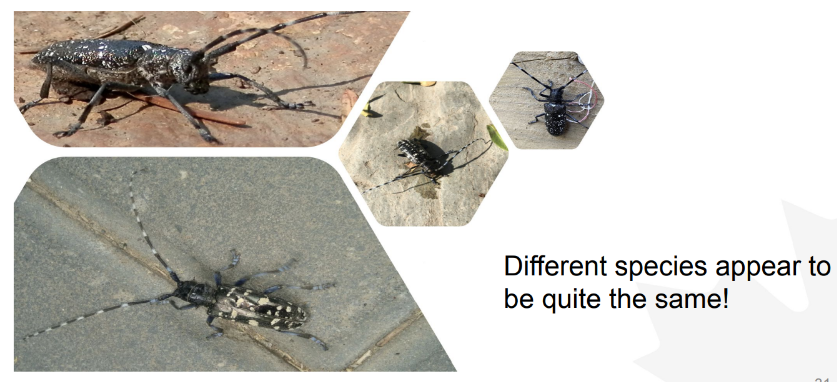
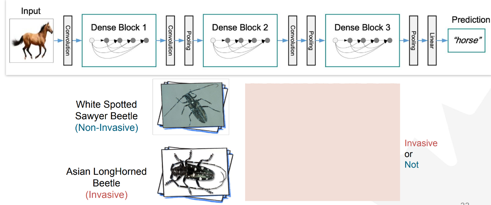
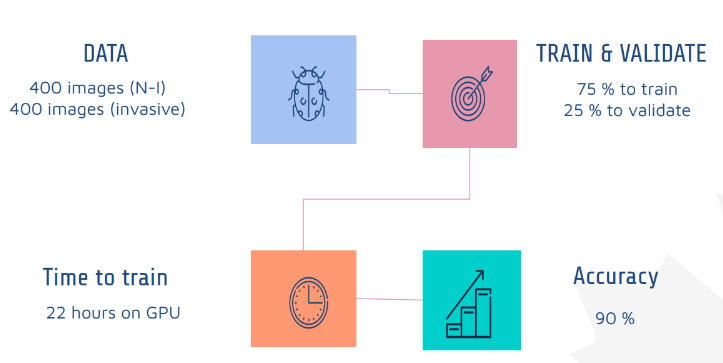
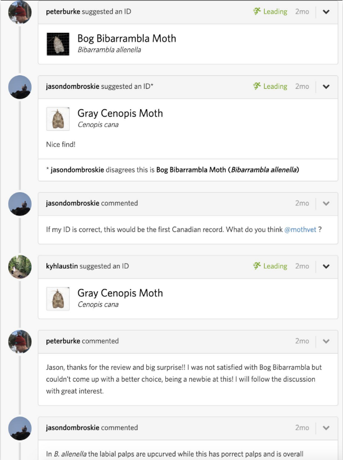
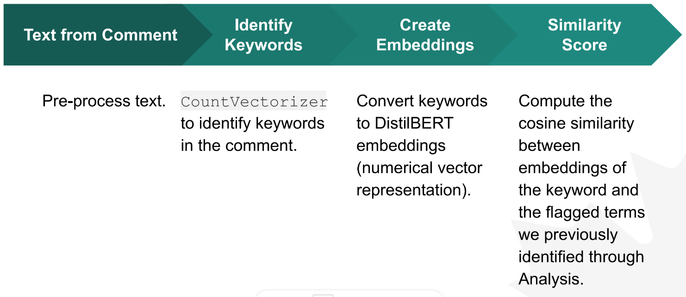
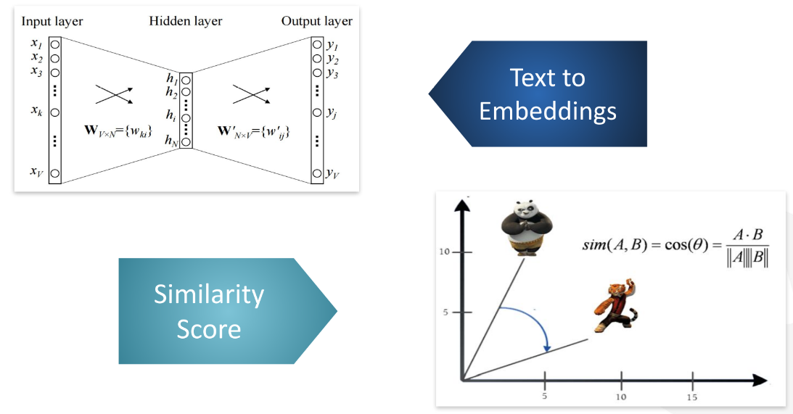
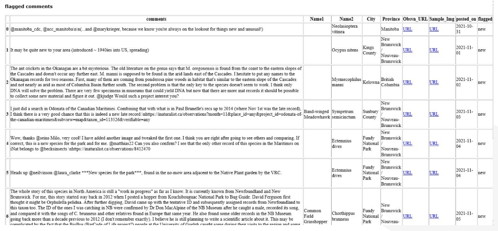
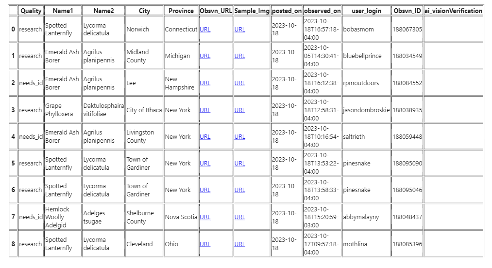

# Invasive Insects Project

## Overview
At the forefront of agricultural biosecurity, the Artificial Intelligence Laboratory (AI Lab) at the Canadian Food Inspection Agency (CFIA) pioneers innovative solutions using state-of-the-art machine learning algorithms. Collaborating with the CFIA’s Plant Health Surveillance Unit and leveraging iNaturalist, the AI Lab has developed cutting-edge tools for species detection and monitoring. These tools, including automated species identification and real-time alert systems, enhance the efficiency and accuracy of CFIA specialists in safeguarding Canada's agricultural landscape.

### Challenge
Canada is a massive geologically diverse country. For this reason, CFIA mainly conducts surveys that are targeted at specific species. AI proves to be a powerful tool for this challenge.

### Solution
We leverage knowledge of the crowd through iNaturalist social networking service. This sns consists of naturalists, citizen scientists, and biologist who share observations of biodiversity across the globe.

We propose two machine learning solutions:

1. Image classification solution using DenseNet.
2. Natural language processing for keyword extraction and flagging

#### 1. Image classification
We don't want to make a mistake of falsely classifying a specie. Machine learning is excellent at searching for patterns of a specie that a naked eye can miss.

You can imagine DenseNet as an artificial brain.

After training a DenseNet model, it was able to achieve 90% at correctly identifying a specie given an image.

#### 2. NLP for keyword extraction and flagging
AI is excellent at processing millions of text in short time. This allows an AI to monitor any outliers within the sns posts and comments to give out alerts.
_Below is an example of a post and its thread._

We can use a machine learning technique that can read and understand text like a human.

AI translating English text into 'AI language' mathematically.

Resulting NLP flagging

#### Example of an Invasive Insect Alert

