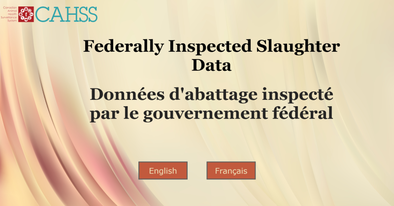

# Poultry and Red Meat Condemnations

## Overview

The CFIA Data Visualization team pulls data from the [Poultry and Red Meat
Condemnations in Federally Registered Establishments reports
(ADH-717)](https://aimis-simia.agr.gc.ca/rp/index-eng.cfm?action=pR&pdctc=&r=278)
to feed the Federally Inspected Slaughter Data dashboard, in the Canadian Animal
Health Surveillance System (CAHSS). The team requested an automated way of
updating their dashboard data with the new reports which get published monthly.

## Solution

At the start of the month, a CRON job runs a python script from a Docker
container that fetches the new report, merges the new data into the historical
data, and updates the GitHub repository automatically.

We opted for a solution that is free and open-source.

If you want to browse the code, you can visit our [GitHub
repository](https://github.com/ai-cfia/PoultryRedMeatCond).
