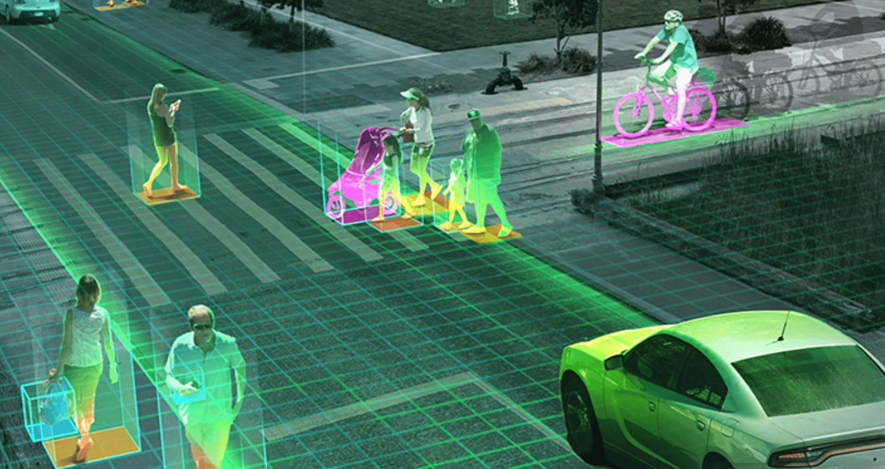
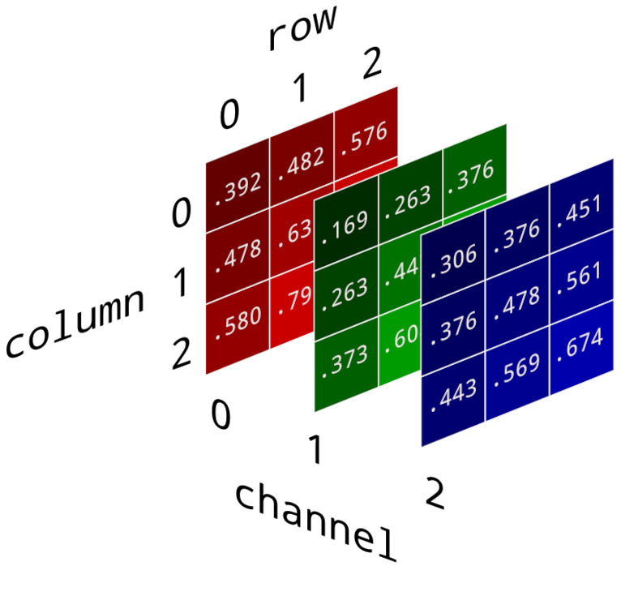

En tant que scientifiques de données à l'ACIA, nous sommes engagés dans le
partage des connaissances, la transparence et l'accessibilité. À travers cet
article, nous visons à définir le fonctionnement sous-jacent des modèles de
vision par ordinateur afin de fournir clarté et compréhension au sujet de cette
technologie et d'expliquer comment nous exploitons ces modèles puissants, pour
ceux et celles qui s'intéressent au domaine.

<!-- truncate -->

---
import React from 'react'; import Carousel from
'@site/src/components/Carousel/Carousel'; import image1 from
'./img/carousel1.png'; import image2 from './img/carousel2.png'; import image3
from './img/carousel3.png'; import image4 from './img/carousel4.png'; import
mediumZoom from 'medium-zoom';

## Vision par ordinateur

### Travaux connexes

Pour lire sur nos projets utilisant la vision par ordinateur, cliquez sur les
liens ci-dessous :

[Classification automatisée des semences : Contrôle de la qualité à l'aide de la
vision par
ordinateur](../2024-06-14-seed-classification/2024-06-14-seed-classification.md)

L'intelligence artificielle (IA) appliquée au traitement d'images a révolutionné
notre capacité à extraire des informations précieuses à partir de données
visuelles. Les avancées dans la recherche en vision par ordinateur et leur
intégration dans l'industrie ont créé une opportunité sans précédent pour une
efficacité et une précision accrues dans des domaines tels que : le contrôle de
la qualité, la détection et la classification d'objets, la surveillance, et bien
plus.

### Notre mission

Ici, au Labo d'IA de l'ACIA, nous exploitons pleinement le potentiel des modèles
de vision par ordinateur pour développer des solutions innovantes répondant aux
besoins spécifiques de nos clients. Sur ce site, nous décrivons certains de nos
projets où nous utilisons des modèles de vision par ordinateur pour des tâches
de classification d'images. Nous vous encourageons à visiter ces pages en
cliquant sur leurs liens respectifs.

Pour comprendre le fonctionnement des modèles de classification d'images, nous
fournissons d'abord un aperçu des concepts fondamentaux en vision par
ordinateur, y compris les considérations importantes à prendre en compte lors du
travail avec des données d'image.

En tant que scientifiques de données à l'ACIA, nous sommes engagés dans le
partage des connaissances, la transparence et l'accessibilité. À travers cet
article, nous visons à définir le fonctionnement sous-jacent des modèles de
vision par ordinateur afin de fournir clarté et compréhension au sujet de cette
technologie et d'expliquer comment nous exploitons ces modèles puissants, pour
ceux et celles qui s'intéressent au domaine.

---

## Introduction à la vision par ordinateur

### _Qu'est-ce que la vision par ordinateur ?_

Les modèles de vision par ordinateur visent à résoudre ce que l'on appelle
mathématiquement des problèmes mal posés. Ils cherchent à répondre à la question
: quelle est l'origine de l'image ?​​​​​​​​​​​​​​

En tant qu'êtres humains, nous faisons cela naturellement. Lorsque des photons
entrent dans nos yeux, notre cerveau est capable de traiter les différents
motifs de lumière nous permettant d'inférer le monde physique devant nous.

Dans le contexte de la vision par ordinateur, nous tentons de reproduire notre
capacité innée de perception visuelle à travers des algorithmes mathématiques.

---

Les modèles de vision par ordinateur pourraient alors être utilisés pour
répondre à des questions liées à :

#### Détection et catégorisation d'objets

La capacité de classifier des objets dans une scène d'image ou de reconnaître le
visage de quelqu'un sur des photos.

#### Catégorisation de scènes et de contexte

La capacité de comprendre ce qui se passe dans une image à travers ses
composants (par exemple : intérieur/extérieur, avec/sans trafic, avec/sans
stationnement, etc.)

#### Informations spatiales qualitatives

La capacité de décrire qualitativement des objets dans une image, tels qu'un
objet en mouvement rigide (par exemple : vélo, poussette), un objet en mouvement
non rigide (par exemple : drapeau), un objet vertical/horizontal/incliné, etc.

---

Cependant, alors que ces tâches semblent être simples, les ordinateurs ont
toujours des difficultés à interpréter et comprendre notre monde complexe.

---

#### Pourquoi la vision par ordinateur est-elle si difficile ?

Pour comprendre pourquoi les ordinateurs semblent lutter pour effectuer ces tâches "de base", nous devons d'abord considérer ce qu'est une image.

---

### Ce que les ordinateurs "voient"

Êtes-vous capable de décrire ce qu'est cette image à partir de ces valeurs ?

**_Une image est un ensemble de nombres, possédant généralement trois canaux de
couleur : Rouge, Vert, Bleu._**

Pour dériver un sens à partir de ces valeurs, l'ordinateur doit réaliser ce que
l'on appelle une reconstruction de l'image. Dans sa forme la plus simplifiée,
nous pouvons considérer ce processus comme un problème inverse​​​​​​​, défini
par :

$x = F^{-1}(y)$

où :

* **y** représente des mesures de données (c'est-à-dire des valeurs de pixels).
* La solution, **x**, est une image.
* $F^{-1}(y)$ est la _fonction inverse_ qui transforme les mesures de pixels,
  **y**, en l'image reconstruite, **x**.

---

Résoudre des _problèmes inverses_ est plus difficile que prévu en raison de leur
nature _mal posée_.

---

        <Carousel images={[
            {
    src: image1,
    alt: "Un chat noir et blanc portant un collier rouge est assis parmi plusieurs pots de pâquerettes, avec des fleurs ouvertes et fermées. L'arrière-plan texturé de fleurs et d'ombres illustre comment un contexte encombré peut rendre la détection des contours des objets difficile en vision par ordinateur.",
    title: "Arrière-plan chargé",
    text: "Un arrière-plan encombré ou texturé peut compliquer la détermination des contours de chaque objet." },
    { src: image2,
    alt: "Deux photographies côte à côte d'un visage de personne, avec les traits centraux floutés pour préserver la vie privée. La photo de gauche montre le visage avec un éclairage frontal, tandis que la photo de droite présente le même visage sous différentes conditions d'éclairage, projetant des ombres sur un côté, ce qui montre comment les variations d'éclairage peuvent affecter la reconnaissance faciale en vision par ordinateur.",
    title: "Variations de l’éclairage",
    text: "Les variations de l'éclairage peuvent rendre la reconnaissance de la même personne difficile (rappel : les ordinateurs 'voient' des valeurs de pixels). Source de l'image : Base de données des visages de Yale." },
    { src: image3,
    alt: "Une séquence de trois photographies montrant une oie. La photo la plus à gauche est un gros plan sur l’œil et le bec de l'oie, ce qui rend difficile son identification sans contexte supplémentaire. La photo du milieu montre la tête et le cou en entier, permettant de l'identifier clairement comme un oiseau. La photo la plus à droite montre l'oie en entier, debout sur l'herbe avec une personne la pointant en arrière-plan, fournissant un contexte complet. Cette séquence illustre comment les variations d'échelle peuvent affecter l'interprétation et la reconnaissance dans la vision par ordinateur.",
    title: "Variations d’échelle",
    text: "Des différences d'échelle peuvent rendre difficile la compréhension du contexte à partir des images. Source de l'image : Rick Scuteri-USA TODAY Sports." },
    { src: image4,
    alt: "Trois photographies d’une statue de Michel-Ange. La première photo montre la statue de profil, détaillant les traits du visage et les cheveux. Les deuxième et troisième photos montrent de grands carrés gris qui masquent des parties centrales de la statue, représentant l'occlusion. Ceci démontre comment des points de vue différents peuvent compliquer la reconnaissance d'un même sujet en vision par ordinateur en raison de la visibilité partielle.",
    title: "Différents points de vue", text: "Les occlusions dues à différents points de vue peuvent rendre la reconnaissance d'un même individu difficile. Source de l'image : Michel-Ange (1475-1564)." }, ]} />

### Qu'est-ce qu'un problème mal posé ?
Lorsqu'une image est enregistrée, il y a une perte inhérente d'information, car
le monde en 3D est projeté sur un plan en 2D. Même pour nous, le fait de réduire
les _informations spatiales que nous obtenons du monde physique peut rendre
difficile l'identification de ce que nous regardons à travers les photos_. Il
peut être difficile de reconnaître des objets en images 2D pour les raisons
suivantes liées aux propriétés _mal posées_....

---

#### Manque d'unicité

<figcaption style={{textAlign: 'center', fontSize:'small'}}>Le point de vue rend impossible l'identification des canettes.</figcaption>

Plusieurs objets peuvent donner lieu aux mêmes mesures, rendant impossible
l'identification de leur identité unique.

#### Incertitude

<figcaption style={{textAlign: 'center', fontSize:'small'}}>Impossible de décrire la scène originale en raison de l'incertitude due au flou.</figcaption>

Le bruit (par exemple : flou, pixellisation, dommages physiques) sur les photos
peut rendre difficile ou impossible l'identification de la véritable
représentation de l'image réelle.

#### Incohérence

<figcaption style={{textAlign: 'center', fontSize:'small'}}>Les chaises prennent de nombreuses formes différentes.</figcaption>

Les variations dans les objets rendent difficile la classification des images
(par exemple : toutes les chaises n'ont pas quatre pieds, etc. -- les humains
parviennent intuitivement à classifier une chaise par son utilité).

---

_Bien qu'à première vue, les tâches de vision par ordinateur puissent sembler superficielles, le problème sous-jacent qu'elles cherchent à résoudre est plutôt complexe !_

---

### Comment résoudre les problèmes mal posés

Afin qu'un modèle de vision par ordinateur puisse surmonter les problèmes mal posés inhérents aux images que nous lui fournissons, nous devons modifier l'équation inverse pour résoudre à la place un problème alternatif, mais similaire, bien posé.

---

Pour qu'un problème soit _bien posé_, il doit satisfaire aux critères suivants,
il doit :

#### Être unique

<figcaption style={{textAlign: 'center', fontSize:'small'}}>Les mesures de l'océan, du ciel et de la voile doivent être identifiées de manière unique.</figcaption>

Le modèle de vision par ordinateur devrait être capable de traiter une image et
d'apprendre les caractéristiques uniques qui composent chaque élément de
l'image.

#### Exister

<figcaption style={{textAlign: 'center', fontSize:'small'}}>L'image reconstruite devrait représenter fidèlement l'objet réel qui a été photographié.</figcaption>

Le modèle de vision par ordinateur devrait produire une image à partir de
mesures qui représente fidèlement l'objet existant qui a été photographié.

#### Être stable

<figcaption style={{textAlign: 'center', fontSize:'small'}}>Le modèle devrait apprendre des caractéristiques uniques des objets indépendamment des variations d'orientation, d'angle, de point de vue, etc.</figcaption>

Le modèle de vision par ordinateur doit être capable de traiter les images de
manière cohérente, même en présence de variations entre différentes images du
même objet.

---

_Nous pouvons donc reformuler l'équation inverse d'origine en une équation
d'optimisation contrainte à la place._

---

### La vision par ordinateur comme un problème d'optimisation contrainte

<figcaption style={{textAlign: 'center', fontSize:'small'}}>La forme 3D supérieure représente les valeurs estimées, F(x).
Les lignes 2D inférieures représentent les données observées, y.
L'EMV qui résout pour le MAP est en rouge. Il a la distance minimale globale entre y et F(x).</figcaption>

Pour imposer les propriétés de _bien posées_, qui permettront à notre modèle de
vision par ordinateur de retourner une solution existante qui est _stable_ et
_unique_, nous pouvons modifier l'_équation inverse_ :

$x = F^{-1}(y)$

en une _équation d'optimisation contrainte_ :

$x^{*} = argmin_{x} \{L(y, F(x)) + λω(x)\}$

où :

* Le premier terme, $L(·)$, est le terme de _fidélité des données_. Il
  représente la différence (c'est-à-dire le _coût_) entre les mesures de données
  observées, $y$, et la prédiction du modèle, $F(x)$.
* Le second terme, $λω(·)$, est le terme de _régularisation_. Il contraint
  l'espace de recherche à un ensemble limité de solutions, afin que la solution
  soit _bien posée_.

L'objectif est de résoudre pour $x^{*}$, (également connu sous le nom de
_maximum a posteriori, MAP_), en utilisant une _fonction directe_, $F(·)$, qui
maximise la vraisemblance que la valeur prédite soit la vraie solution, réelle
et existante, $x*$.

L'_estimation du maximum de vraisemblance_ (EMV) est la valeur qui minimise le
coût, L, entre les données mesurées, $y$, et la valeur prédite, $F(x)$, à partir
d'un ensemble contraint de solutions possibles.

