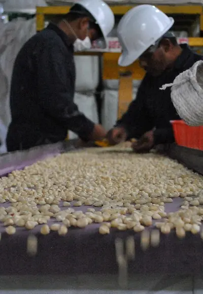
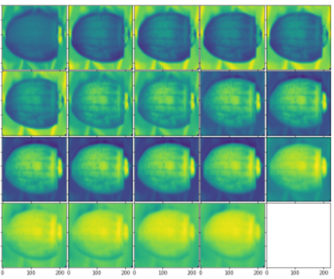
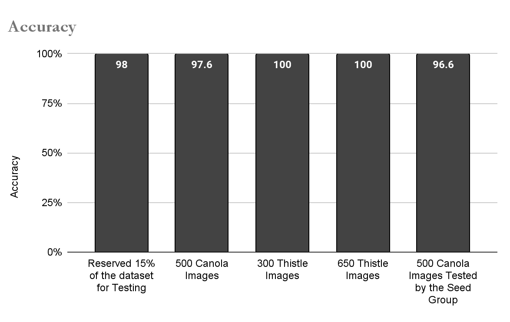
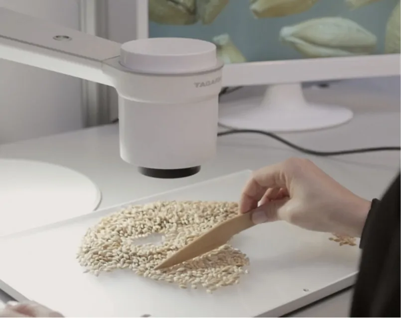
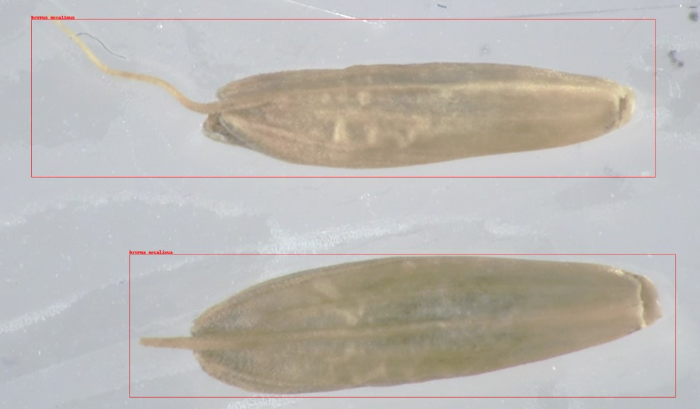
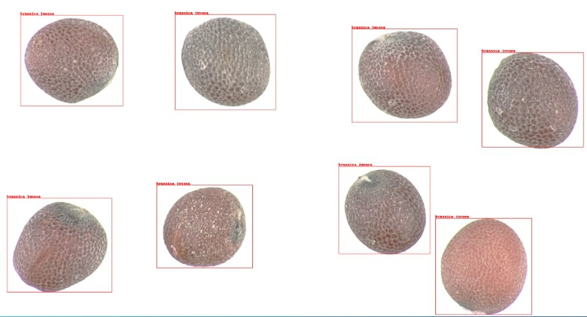
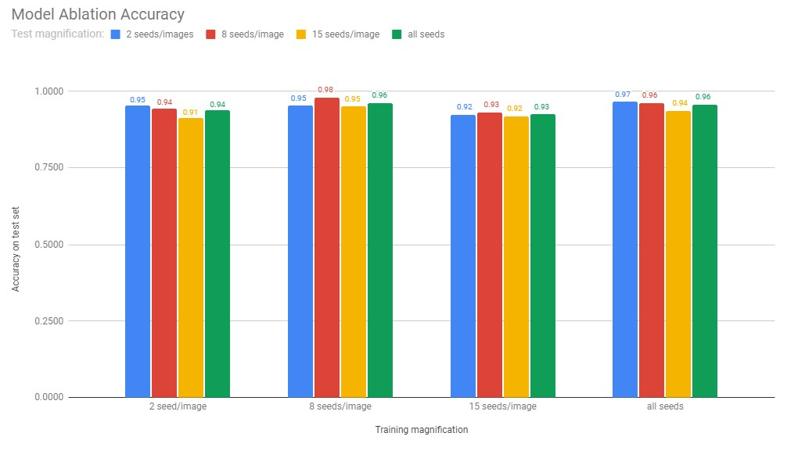

Dans cet article, nous motivons le besoin de modèles de vision par ordinateur
pour la classification automatique des espèces de semences. Nous démontrons
comment nos modèles personnalisés ont obtenu des résultats prometteurs en
utilisant des images de semences du « monde réel » et nous décrivons nos
orientations futures pour le déploiement d'une application facile à utiliser:
SeedID.

<!-- truncate -->

---

## Introduction

L'intelligence artificielle (IA) pour la vision par ordinateur a révolutionné
notre capacité à obtenir des informations à partir des images. En associant des
algorithmes d'IA à l'analyse de données en format de photographes, la vision par
ordinateur a révolutionné de nombreux secteurs, transformant la manière dont
nous interagissons avec les machines. Les avancées en recherche en vision par
ordinateur et leur intégration en industrie ont créé une opportunité sans
précédent d'améliorer l'efficacité et la précision dans des domaines tels que le
contrôle de la qualité, la détection et la classification d'objets, la
surveillance, et bien plus encore.

### Notre mission

Au laboratoire d'IA de l'ACIA, nous exploitons le plein potentiel des modèles de
vision par ordinateur. Notre équipe dévouée de scientifiques des données
exploite la puissance de cette technologie transformatrice et développe des
solutions personnalisées adaptées aux besoins spécifiques de nos clients.

Ici, nous motivons le besoin de modèles de vision par ordinateur pour la
classification automatique des espèces de semences. Nous démontrons comment nos
modèles personnalisés ont obtenu des résultats prometteurs en utilisant des
images de semences du « monde réel » et nous décrivons nos orientations futures
pour le déploiement d'une application facile à utiliser: SeedID.

Au laboratoire d'IA de l'ACIA, nous nous efforçons non seulement de repousser
les frontières de la science en exploitant des modèles de pointe, mais aussi de
rendre ces services accessibles aux autres et de favoriser le partage des
connaissances, pour continuer le progrès de notre société canadienne.

---

## Importance de l'industrie semencière Canadienne

L'industrie semencière canadienne s'est forgé une réputation mondiale dans la
production, le traitement et l'exportation de semences de qualité supérieure
pour un large éventail de cultures. Son succès est dû à l'engagement du Canada
en faveur de l'innovation et du développement de technologies de pointe, ce qui
lui permet de fournir des produits de haute qualité qui répondent aux besoins
nationaux et internationaux.

Naturellement, une collaboration entre le groupe de chercheurs sur la science
des semences du Canada et le laboratoire d'IA a été mise en place pour maintenir
le rôle du Canada en tant que responsable réputé de l'industrie mondiale des
semences.

### Contexte : Contrôle de la qualité

La qualité d'une culture de semences est reflétée dans un rapport de classement,
où la note finale reflète le degré de conformité de la culture avec les normes
de qualité minimales du Canada. Les facteurs utilisés pour déterminer la qualité
de la récolte comprennent, entre autres l'analyse de la pureté et le pourcentage
de germination et de maladie des semences. Le taux de germination de la graine
et sa résistance aux maladies peuvent donner une idée de l'état de santé général
de la graine. L'évaluation de la pureté du contenu est essentielle pour
s'assurer que la récolte contient une forte concentration de la matière première
souhaitée et qu'elle est exempte de contaminants, tels que les graines d'autres
cultures ou les graines de mauvaises herbes.

### Motivation

Actuellement, l'évaluation de la qualité d'une récolte est effectuée
manuellement par des experts humains. Toutefois, ce processus est fastidieux et
chronophage. Au laboratoire d'IA, nous utilisons des modèles avancés de vision
par ordinateur pour classer automatiquement les espèces de semences à partir
d'images, ce qui rend ce processus plus efficace et plus fiable.

---

## Surmonter les limitations grâce à la vision par ordinateur

---

### Pénurie d'analystes

La pénurie d'analystes experts en semences constitue un défi important pour
l'industrie des semences. La demande d'évaluation précise et efficace de la
qualité des cultures augmente, mais la disponibilité d'analystes hautement
qualifiés est limitée. Cette pénurie peut entraîner des retards dans les
évaluations de la qualité, des obstacles dans la production et des erreurs
potentielles dans la classification des semences.

#### La contribution de l'IA (Pénurie d'analystes)

La vision par ordinateur constitue une solution prometteuse pour remédier à
cette pénurie en analysant et en classant efficacement les semences avec une
intervention humaine minimale. Ces modèles peuvent être entraînés sur de vastes
ensembles de données d'images de semences, ce qui leur permet de reconnaître des
motifs et des tendances, de détecter des variations et de classer les semences
en fonction de paramètres de qualité prédéterminés.

En adoptant des modèles de vision par ordinateur pour l'analyse des semences,
les entreprises et les institutions agricoles peuvent alléger le fardeau de la
pénurie d'experts, rationaliser leurs opérations et améliorer la productivité
globale. Cette technologie permet au Canada de répondre à la demande croissante
d'évaluation de la qualité des semences, ce qui se traduit par une amélioration
du rendement des cultures, une sélection fiable des semences et, en fin de
compte, des pratiques agricoles durables.

---

### Contraintes temporelles

L'analyse manuelle des semences est un processus qui prend du temps et qui pose
des problèmes en termes d'efficacité et de rapidité. La classification des
semences prend du temps en raison de la complexité et du volume des échantillons
de semences. Les experts humains doivent consacrer beaucoup de temps et
d'efforts à l'inspection visuelle et à la classification de chaque graine, ce
qui entraîne des goulets d'étranglement et des retards potentiels dans le
processus de contrôle de la qualité.

#### La contribution de l'IA (Contraintes temporelles)

Computer vision models offer a solution to these bottlenecks by automating the
analysis. By rapidly processing large volumes of seed samples, they
significantly reduce the time required for classification enabling faster and
more efficient seed classification while maintaining accuracy and consistency.

---

### Le coût

Le développement d'une expertise dans l'analyse des semences exige une formation
approfondie et l'exposition à divers échantillons de semences, ce qui peut
s'avérer à la fois coûteux et chronophage. Les coûts associés et le temps
nécessaire pour former des analystes experts comprennent non seulement les
programmes de formation, mais aussi les ressources requises pour l'expérience
pratique. Le temps nécessaire aux analystes pour acquérir les compétences et
l'expérience requises peut être long, ce qui aggrave encore la pénurie de
professionnels qualifiés.

#### La contribution de l'IA (Le coût)

Les modèles de vision par ordinateur peuvent offrir une approche plus évolutive
et plus efficace de l'analyse des semences, en atténuant les coûts et les
contraintes de temps associés à la formation d'analystes experts. Les modèles
peuvent être entraînés sur de vastes ensembles de données d'images de semences,
ce qui élimine la nécessité d'une formation humaine approfondie. En outre, les
modèles de vision par ordinateur peuvent apprendre et s'améliorer
continuellement au fil du temps, s'adaptant rapidement aux nouvelles variétés de
semences et améliorant leur précision. En outre, ils éliminent les biais
subjectifs qui peuvent résulter de l'interprétation humaine, fournissant ainsi
une évaluation objective et normalisée de la qualité des semences.

---

En tirant parti de la puissance de la vision par ordinateur, l'industrie des
semences peut surmonter les limites liées à la pénurie de main-d'œuvre, aux
coûts de formation et aux contraintes de temps, ce qui permet une analyse plus
rapide et plus efficace des semences.

---

## Objectif : classification automatique des espèces de semences

Ce projet vise à développer et à déployer un cadre de vision par ordinateur pour
la classification des espèces de semences. En automatisant ce processus de
classification, nous serons en mesure de rationaliser et d'accélérer
l'évaluation de la qualité des cultures. Nous développons des algorithmes
avancés et des techniques d'apprentissage profond, tout en garantissant une
évaluation impartiale et efficace de la qualité des cultures, ouvrant ainsi la
voie à de meilleures pratiques agricoles.

 *Source d'image: VideometerLab*

## Projet n°1: Videometer

Dans ce projet, nous utilisions un modèle de vision par ordinateur de type
réseau neuronal convolutif (CNN) pour évaluer la pureté du contenu, en
identifiant et en classant les espèces de semences souhaitées par rapport aux
espèces de semences non souhaitées.

Nous avions réussi à identifier la contamination par trois espèces de mauvaises
herbes différentes dans un mélange de sélection d'échantillons de blé.

Notre modèle était modifié pour accepter des images multispectrales à haute
résolution de 19 canaux et atteignait une précision supérieure à 95 % sur les
images réservées à l'évaluation.

Nous avions d’autant plus exploré le potentiel de notre modèle pour la
classification de nouvelles espèces, en injectant cinq nouvelles espèces de
canola dans l'ensemble de données. Les résultats préliminaires de cette
expérience montraient une précision d'environ 93 % sur les images réserves. Ces
résultats soulignent le potentiel de notre modèle pour une utilisation continue,
même si de nouvelles espèces de semences sont introduites.

### Données (Projet n°1)

 *Image multispectrale à 19 canaux , Carduus nutans*

Notre CNN a été entraîné à classer les espèces suivantes :

- Trois espèces différentes de chardons des champs (mauvaises herbes):
  - Cirsium arvense
  - Carduus nutans
  - Cirsium vulgare
- Une espèce de blé:
  - Triticum aestivum subspecies aestivum
- Cinq espèces différentes de Canola:
  - Brassica napus subspecies napus
  - Brassica juncea
  - Brassica juncea (yellow)
  - Brassica rapa subspecies oleifera
  - Brassica rapa subspecies oleifera (brown)

### Résultats (Projet n°1)

 *Précision du modèle de >95%*

Nous montrons que notre modèle est capable d'identifier correctement chaque
espèce de graine avec une précision de plus de 95 %.

De plus, lorsque les trois graines de chardon des champs ont été intégrées avec
le blé, le modèle a atteint une précision moyenne de 99,64 % sur 360 graines.
Cela démontre la robustesse du modèle et sa capacité à identifier de nouvelles
images.

Enfin, nous introduisions cinq nouvelles espèces de canola et évaluions les
performances de notre modèle. Les résultats préliminaires montraient une
précision d'environ 93 % sur les images réservées à l'évaluation.

---

 *Source d'image: TAGARNO microscope*

## Projet n°2: Tagarno

Dans ce projet, le cadre du modèle de vision par ordinateur suivait deux étapes
pour identifier un total de 15 espèces de semences différentes à différents
niveaux d'agrandissement.

En premier, un modèle CNN identifiait chaque occurrence de semence dans l'image.
Ensuite, un modèle « transformateur de vision » était utilisé pour classifier
chaque espèce.

Nous effectuions plusieurs études d'ablation en entraînant sur un profil de
grossissement puis en évaluant sur des semences provenant d'un ensemble de
grossissement différent. Nous présentons des résultats préliminaires avec une
précision de plus de 90% pour tous les niveaux de grossissement.

### Données (Projet n°2)

Trois niveaux de grossissement différents ont été utilisés pour les 15 espèces
suivantes :

- Ambrosia artemisiifolia
- Ambrosia trifida
- Ambrosia psilostachya
- Brassica junsea
- Brassica napus
- Bromus hordeaceus
- Bromus japonicus
- Bromus secalinus
- Carduus nutans
- Cirsium arvense
- Cirsium vulgare
- Lolium temulentum
- Solanum carolinense
- Solanum nigrum
- Solanum rostratum

 *Niveau de grossissement: 2 semences/image, Bromus
Secalinus*

 *Niveau de grossissement: 8 semences/image, Brassica Junsea*

Le niveau de grossissement est indiqué par le nombre total de graines présentes
dans l'image, soit : 2, 8 ou 15 semences par image.

### Résultats (Projet n°2)

 *Performance du modèle*

Afin d'établir un protocole d'enregistrement d'images, nous entraînions des
modèles distincts à partir d'un sous-ensemble de données à chaque niveau de
grossissement, puis nous évaluons les performances du modèle sur l'ensemble des
niveaux de grossissement.

Les résultats préliminaires démontrent la performance du modèle à identifier
correctement les espèces de semences à travers les grossissements avec une
précision de plus de 90%.

Cela démontre le potentiel du modèle à classifier avec précision des nouveaux
images à différents niveaux de grossissement.

### Défis

Nous reconnaissons les défis associés à l'enregistrement des images par
différentes méthodes et nous nous efforçons de continuer à améliorer la
robustesse de notre modèle en incorporant plus d'espèces de graines, en
améliorant la généralisation à travers les niveaux de grossissement, et en
réduisant notre cadre de modèle de 2-étapes en 1 pour une meilleure efficacité.

---

## Prochaines étapes : Déploiement

Avec la réussite de la classification des images de semences par vision par
ordinateur, notre prochain objectif est de déployer notre modèle dans une
application source ouverte : SeedID. Notre but est de fournir une plateforme
intuitive et accessible qui permet aux utilisateurs de tous niveaux d'expertise
de classifier facilement et avec précision les échantillons de semences.

L'objectif est de simplifier le processus de classification des semences et
d'éliminer les obstacles techniques qui pourraient entraver son utilisation.

Notre stratégie de déploiement comprend également des tests approfondis et de
validation pour assurer la fiabilité et la précision des résultats de
classification des semences. Une évaluation rigoureuse nous permettra d'ajuster
le modèle et de traiter les limites ou biais potentiels, garantissant des
performances robustes pour différents types et conditions de semences.

Notre vision est de donner aux utilisateurs un moyen d'accéder aux modèles de
vision par ordinateurs d'une manière transparente. En déployant cette
application à source ouverte, nous favorisons l'efficacité et l'accessibilité
dans l'analyse des semences pour avancer des pratiques agricoles.

---

## Conclusion

 *Connecter les idées*

Le projet de classification des semences est un exemple de la collaboration
fructueuse et continue entre le laboratoire d'IA et le groupe de la science des
semences de l'ACIA. En mettant en commun nos connaissances et nos expertise
respectives, nos deux équipes contribuent à l'avancement de l'industrie
semencière canadienne.

Nous démontrons le succès de l'utilisation d'apprentissage profond en tant
qu'outils pour les tâches de traitement d'images et nous démontrons leur
potentiel pour améliorer la précision et l'efficacité de l'évaluation de la
qualité des cultures, ce qui profitera à la fois à l'industrie agricole et aux
consommateurs.

### L'avenir : Appel à collaboration

En tant que scientifiques de données, nous reconnaissons l'importance de la
collaboration et nous nous engageons à respecter les principes de la science
ouverte. Notre objectif est de promouvoir la transparence et l'engagement par le
partage ouvert avec le public.

En rendant notre application à source ouverte, nous invitons nos collègues, les
chercheurs, les experts en semences et les développeurs à contribuer à son
amélioration et à sa personnalisation. Cette approche collaborative favorise
l'innovation, permettant à la communauté d'améliorer collectivement les
capacités de l'application SeedID et de répondre aux exigences spécifiques du
domaine.

