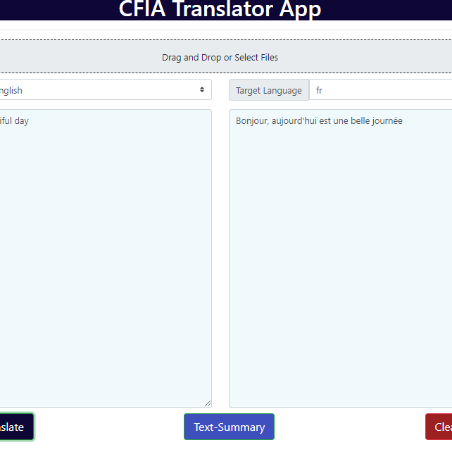

Dans cet article, nous sommes ravis d'être à l'avant-garde de cette technologie
passionnante et en rapide évolution, et de partager quelques-uns de nos projets
pour démonstration.

<!-- truncate -->

---

## Introduction

L'intelligence artificielle (IA) et le traitement automatique des langues (TAL)
sont devenus de plus en plus importants dans le monde moderne. Avec l'essor des
interférences conversationnelles, des agents conversationnels et des assistants
virtuels, le TAL est devenu un outil essentiel pour améliorer la communication
entre les humains et les machines. L'un des modèles de TAL les plus
impressionnants de ces derniers temps est ChatGPT, un grand modèle de langage
entraîné par OpenAI basé sur l'architecture GPT-3.5. ChatGPT a la capacité de
comprendre le langage naturel et de générer des réponses semblables à celles des
humains à une grande variété de sollicitations.

Malgré ses capacités impressionnantes, les utilisateurs peuvent rencontrer des
limitations lors de l'utilisation de ChatGPT pour des tâches très spécifiques,
telles que fournir des informations historiques précises sur des pays. Comme
tout système d'IA, ChatGPT a ses limites et peut bénéficier d'une formation
supplémentaire pour améliorer sa précision et son efficacité pour des tâches
spécifiques.

En tant que scientifiques de données, nous travaillons constamment à affiner et
à peaufiner ChatGPT et d'autres modèles de TAL pour mieux répondre aux besoins
de nos clients. En personnalisant ces modèles pour travailler avec des ensembles
de données et des tâches spécifiques, nous pouvons rendre des fonctionnalités
auparavant indisponibles possibles. Dans cet article, nous sommes excités d'être
à l'avant-garde de cette technologie passionnante et en rapide évolution, et de
partager quelques-uns de nos projets pour démonstration.

---

## Projet n° 1 : Projet de classification des rapports de maladie IMS

### Objectif (Projet n° 1)

L'objectif de ce projet est de développer un pipeline efficace qui peut
automatiquement détecter les rapports de maladie au sein de documents anglais
(PDF) en utilisant l'intelligence artificielle (IA). Le pipeline utilisera des
techniques de TAL pour lire et résumer des documents qui sont spécifiquement
axés sur les sujets de rapport de maladie. L'objectif ultime est de permettre au
client de traiter de grandes quantités de tels documents en quelques minutes, ce
qui aidera à gagner du temps et à augmenter l'efficacité.

### Utilisation potentielle (Projet n° 1)

1. Permet une analyse rétrospective des incidents
2. QA des données structurées via une analyse comparative du texte pour
   l'analytique des données et les rapports de performance des départements
   (Exemple actuel)
3. Soutien aux revues systématiques des incidents pour des analyses
   administratives, scientifiques ou stratégiques.
4. Combinaison des points 1 à 3 pour un soutien potentiel en temps réel à des
   parcours possibles.

Rapport pour le Conseil du Trésor sur l'indicateur de résultat départemental -
Une majorité (plus de 84 %) des rappels à haut risque sont émis avant que la
maladie soit signalée à l'ACIA.

### Livrable (Projet n° 1)

Comme résultat final de ce projet, le client recevra une application web
connectée à un modèle d'apprentissage machine entraîné et au pipeline.
L'application sera capable de traiter un grand nombre de documents anglais axés
sur les sujets de rapport de maladie.

### Phase (Projet n° 1)

Actuellement, le projet est en phase de test et de mise en œuvre, où différents
modèles sont en cours de développement pour s'adapter aux données de maladie.
Selon les résultats, le ChatGPT-3 affiné a montré des résultats prometteurs et a
été déployé. L'étape suivante consiste à rendre ce livrable pour le client.

### Prochaine étape (Projet n° 1)

La détection de maladie peut être un tremplin pour étendre le projet à un outil
général de questions-réponses IA. Cela est discuté avec le client Devendra et il
a montré un grand intérêt.

---

## Projet n°2 : Projet de classification de la viande HS (Jan-Nov 2022)

### Objectif (Projet n°2)

Une initiative de classification de texte propulsée par l'intelligence
artificielle est en cours pour automatiser le processus de marquage manuel d'un
volumineux fichier de données HS. L'entrée du système est la description des
produits alimentaires générée par l'homme, et la sortie est la catégorisation du
texte en différentes catégories de viande, telles que Cru ou Prêt-à-manger,
déterminée par le modèle d'IA.

### Utilisation potentielle (Projet n°2)

Le client a spécifié que leur intention dans ce projet était à des fins de
recherche.

### Méthodologie (Projet n°2)

Le projet utilise des techniques de traitement automatique des langues à la
pointe de la technologie, en particulier le modèle de transformation BERT, pour
analyser efficacement d'énormes volumes de texte. Cela fournira aux parties
prenantes pertinentes une compréhension plus profonde de leurs données,
éliminant le besoin d'examen manuel et de marquage de milliers d'entrées. Le
résultat sera une réduction substantielle du temps et des efforts nécessaires
pour obtenir un aperçu des données.

### Résultat (Projet n°2)

Le client a fourni des données de formation qui ont été utilisées pour former le
modèle BERT. Le modèle a réussi à étiqueter avec précision des catégories plus
larges telles que la volaille, le bœuf, le porc et la viande d'alligator
(précision de plus de 99 %). Cependant, il a eu du mal à étiqueter des
catégories très spécifiques (précision de 80 %) telles que le bœuf cru par
rapport au bœuf en conserve car les données de formation manquaient de motifs et
de détails.

### Livrable (Projet n°2)

En tant que livrable final de ce projet, le client recevra un programme qui peut
traiter leurs demandes d'entrée. Le programme étiquettera et générera un fichier
.csv pour le client.

### Prochaine Étape (Projet n°2)

Le client a mentionné un projet potentiel pour la classification des poissons à
l'avenir.

---

## Projet n°3 : Application Traducteur Anglais-Français (Sept 2022 - 2023)

### Objectif (Projet n°3)

L'application Traducteur Ang-Fr, Fr-Ang vise à traduire et résumer de manière
sécurisée les documents classifiés sur les serveurs de l'ACIA. Elle vise à
résoudre le manque de protection des données de Google Translate tout en
maintenant le niveau de précision de la traduction de DeepL Translate avec un
modèle d'apprentissage automatique, BERT.

### Utilisation Potentielle (Projet n°3)

1. Traduction rapide pour l'un des documents suivants - .pdf, .docx, .txt, .pptx
2. Résumé rapide du corpus de texte pour réduire le temps de lecture manuel

### Livrable (Projet n°3)

En tant que livrable final de ce projet, les clients ayant accès au VPN de
l'ACIA peuvent utiliser l'application web trouvée
[ici](https://translatorv1.azurewebsites.net/). Le client peut glisser-déposer,
télécharger ou taper directement pour obtenir la traduction du document entrant.
La fonction de résumé de texte peut être utilisée sur la même entrée pour
fournir un résumé du document entrant.

Essayez le traducteur [ici](https://translatorv1.azurewebsites.net/).

### Phase (Projet n°3)

Déployé et prêt à tout moment.

### Prochaine Étape (Projet n°3)

L'application est extensible pour un meilleur modèle et plus de fonctionnalités.
Comme elle utilise l'application dorsale de ChatGPT, elle peut non seulement
résumer, mais aussi effectuer de nombreuses autres tâches.

---

## Conclusion

En conclusion, le développement de la technologie du traitement automatique des
langues a inauguré une nouvelle ère d'interaction personne-machine, rendant
possible pour nous de communiquer avec les machines de manière auparavant
inimaginable. Avec l'arrivée de ChatGPT et d'autres modèles avancés de TAL, nous
avons constaté d'importantes améliorations dans la précision et l'efficacité des
interfaces conversationnelles, des agents conversationnels et des assistants
virtuels.

À travers les exemples que nous avons explorés dans cet article, il est clair
que la technologie TAL a le potentiel de révolutionner une large gamme
d'industries et d'applications ici à l'ACIA. En exploitant la puissance du TAL,
nous pouvons développer des façons de communiquer avec les utilisateurs et les
clients plus efficaces et efficients, ce qui conduit finalement à de meilleurs
résultats pour les entreprises et les particuliers.

Cependant, comme toute nouvelle technologie, il y a aussi des défis à relever.
Les préoccupations éthiques concernant la protection des données et le biais des
systèmes d'IA sont des considérations importantes qui doivent être soigneusement
gérées à mesure que la technologie TAL continue d'évoluer. En outre, la sécurité
des données est une grande préoccupation, c'est pourquoi notre équipe collabore
étroitement avec l'équipe Microsoft pour garantir la sécurité et la
confidentialité des données traitées par l'IA.

En même temps, nous sommes enthousiastes quant aux opportunités qui se profilent
dans le domaine du TAL. En tant que scientifiques de données, nous nous
engageons à continuer à affiner et améliorer ChatGPT et d'autres modèles de TAL,
afin que nous puissions développer des outils encore plus puissants pour
soutenir l'interaction personne-machine et stimuler l'innovation dans un large
éventail d'industries. Nous sommes confiants dans l'avenir du TAL et nous sommes
impatients de faire partie de ce voyage passionnant.

